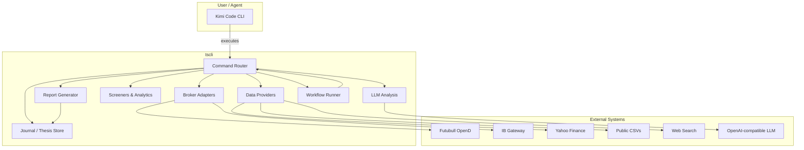
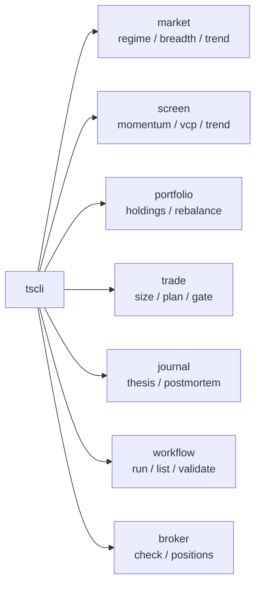
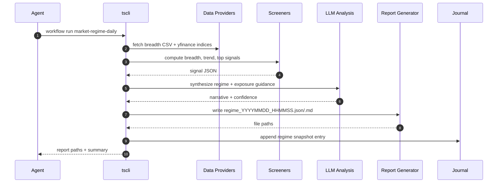

# Kimi Trading Skills — Design Specification

> **Status:** Draft  
> **Date:** 2026-07-09  
> **Author:** AI design session  
> **Source inspiration:** [Claude Trading Skills](https://tradermonty.github.io/claude-trading-skills/en/) ([repo](https://github.com/tradermonty/claude-trading-skills.git))

---

## 1. Purpose

Build a **code-first, CLI-driven trading assistant** that can be consumed as a Kimi Code CLI skill. It ports the systematic market-analysis, screening, portfolio, and workflow concepts from *Claude Trading Skills* to an environment where:

- The broker layer is **Futubull OpenD** (Moomoo-compatible) and/or **IBKR via IB Gateway**.
- **No Financial Modeling Prep (FMP) or Finviz subscription** is available.
- Free or already-funded data sources are used instead (`yfinance`, broker historical data, public CSVs, web search, and LLM reasoning).
- The agent’s primary interaction pattern is **executing CLI commands**, reading JSON/Markdown reports, and invoking an LLM for judgement-heavy analysis.

The output is a reusable skill directory (`skills/kimi-trading-skills/`) plus a Python CLI (`tscli`) that implements the commands the skill refers to.

---

## 2. User Stories

| ID | As a … | I want to … | So that … |
|----|--------|-------------|-----------|
| US-1 | solo trader | run a daily market-regime check with one command | I get exposure guidance before the open |
| US-2 | swing trader | screen for momentum-burst / VCP-like candidates using free data | I can build a ranked watchlist |
| US-3 | portfolio manager | fetch live holdings from Futubull/IBKR and see allocation/risk | I know whether to rebalance |
| US-4 | risk manager | compute position size from entry, stop, and account risk | I do not oversize a trade |
| US-5 | systematic trader | run a workflow YAML that chains CLI steps | I can repeat a multi-step routine without ad-hoc scripting |
| US-6 | AI agent | call a CLI, receive structured JSON, and ask an LLM to interpret it | I do not rewrite scripts every analysis |
| US-7 | reviewer | see every recommendation tagged with data source and confidence | I can audit why a signal was generated |

---

## 3. Constraints

### 3.1 Broker platforms
- **Futubull via OpenD** — fully Moomoo-compatible, funded account and market data available.
- **Interactive Brokers via IB Gateway** — NASDAQ data subscription available.
- No other broker APIs are in scope for the first release.

### 3.2 Data sources
- **No FMP API** — all FMP-dependent functionality must be skipped or rebuilt with an alternative.
- **No Finviz** — Finviz screener URL generation is removed; visual web scraping is not a substitute.
- **Allowed sources:**
  - `yfinance` for EOD prices, fundamentals, and earnings calendars.
  - Futubull OpenD for account/positions, historical bars, and option chain (where supported).
  - IB Gateway for account/positions, historical bars, and scanner results.
  - Public CSVs (e.g., breadth data) for market-regime components.
  - Web search for news, macro, and event context.
  - LLM for synthesis, scoring, theme detection, and scenario analysis.

### 3.3 Documentation
- Markdown only, GitHub-flavored, light theme.
- **No ASCII charts or diagrams.** Use **Mermaid** syntax for all visuals.
- All Mermaid blocks must render without syntax errors.

### 3.4 Implementation style
- **Python-first CLI** (`tscli`) is the default execution surface.
- Agent must execute CLI commands rather than generate throw-away scripts.
- Every CLI emits both **JSON and Markdown** reports.
- AI-LLM analysis is used wherever judgement, summarization, or pattern recognition adds value.

### 3.5 Harness adoptability
- The underlying CLI and schemas are harness-agnostic.
- The Kimi-specific layer is isolated in `skills/kimi-trading-skills/SKILL.md` and `references/`.

---

## 4. Functional Scope

### 4.1 In scope (MVP)
1. `tscli` command router with subcommands grouped by domain.
2. Broker adapter abstraction and concrete adapters for OpenD, IB Gateway, and a manual fallback.
3. Data-provider layer: `yfinance`, OpenD, IB Gateway, public CSV, web search.
4. Market-regime daily workflow: breadth, trend, top detector, exposure guidance.
5. Swing-opportunity screeners: momentum burst, trend-template, VCP-like (price/volume pattern) using yfinance.
6. Portfolio manager: fetch positions, compute allocation/concentration/risk, emit rebalance recommendations.
7. Position sizer with fixed-fractional, ATR, and Kelly modes.
8. Pre-trade discipline gate: checklist + LLM sanity check before journal entry.
9. Trade journal / thesis store with a stable JSON schema.
10. Workflow runner that reads YAML manifests, executes CLI steps, and stops at decision gates.
11. LLM analysis prompts stored as markdown templates in `references/prompts/`.

### 4.2 Out of scope or replaced
- Live order execution. The system emits **order templates only**; a human places the order.
- FMP/Finviz-native screeners. These are either omitted or rewritten with `yfinance`/broker data.
- Sub-second real-time streaming. CLI commands are snapshot/poll based.
- Cryptocurrency, forex, and derivatives beyond US equities/ETFs/options context.

---

## 5. Design Architecture

### 5.1 High-level components



### 5.2 Command groups



### 5.3 Data flow for a daily market-regime workflow



---

## 6. Key Interfaces

### 6.1 Broker adapter contract

```python
class BrokerAdapter(Protocol):
    def name(self) -> str: ...
    def is_connected(self) -> bool: ...
    def get_positions(self) -> list[Position]: ...
    def get_account(self) -> AccountSummary: ...
    def get_historical_bars(
        self,
        symbol: str,
        bar_size: str,
        lookback_days: int,
    ) -> list[Bar]: ...
    def get_option_chain(self, symbol: str) -> dict | None: ...
```

Concrete adapters:
- `FutubullOpenDAdapter`
- `IbGatewayAdapter`
- `ManualBrokerAdapter` (default-deny / fixture mode)

### 6.2 Report envelope schema

```json
{
  "schema_version": "1.0",
  "skill": "market-regime",
  "metadata": {
    "run_at": "2026-07-09T09:30:00Z",
    "data_sources": ["yfinance", "public_csv"],
    "broker_adapter": "manual",
    "llm_model": "gpt-4o-mini"
  },
  "data": { }
}
```

### 6.3 Thesis / journal entry schema (derived from `trader-memory-core`)

```json
{
  "thesis_id": "uuid",
  "ticker": "AAPL",
  "created_at": "2026-07-09T09:30:00Z",
  "updated_at": "2026-07-09T09:30:00Z",
  "thesis_type": "growth_momentum",
  "status": "ENTRY_READY",
  "thesis_statement": "...",
  "entry": { "target_price": 230.0, "conditions": [] },
  "exit": { "stop_loss": 218.0, "take_profit": 253.0 },
  "position": { "shares": 100, "risk_pct_of_account": 1.0 },
  "origin": { "skill": "vcp-screener", "output_file": "..." }
}
```

### 6.4 Order template schema (human review only)

```json
{
  "execution_mode": "pre_place",
  "symbol": "AAPL",
  "side": "buy",
  "qty": 100,
  "type": "stop_limit",
  "stop_price": 230.0,
  "limit_price": 231.0,
  "time_in_force": "day",
  "order_class": "bracket",
  "take_profit": { "limit_price": 253.0 },
  "stop_loss": { "stop_price": 218.0 },
  "requires_manual_confirmation": true,
  "source_skill": "breakout-trade-planner"
}
```

---

## 7. CLI Command Reference (MVP)

| Command | Purpose | Key flags |
|---------|---------|-----------|
| `tscli broker check` | Verify broker connection | `--broker opend\|ibkr\|manual` |
| `tscli broker positions` | List positions + account summary | `--broker opend\|ibkr` `--output-dir` |
| `tscli market regime` | Daily regime report | `--as-of`, `--output-dir` |
| `tscli market breadth` | Breadth analyzer | `--csv-url`, `--output-dir` |
| `tscli screen momentum` | Momentum-burst scan | `--universe`, `--min-cap`, `--output-dir` |
| `tscli screen vcp` | VCP-like pattern scan | `--universe`, `--output-dir` |
| `tscli portfolio analyze` | Holdings + allocation + risk | `--broker opend\|ibkr`, `--output-dir` |
| `tscli trade size` | Position size | `--account-size`, `--entry`, `--stop`, `--risk-pct` |
| `tscli trade plan` | Generate order template | `--thesis-file`, `--output-dir` |
| `tscli trade gate` | Pre-trade checklist + LLM check | `--thesis-file` |
| `tscli journal create` | New thesis entry | interactive or `--from-report` |
| `tscli journal list` | List open theses | `--status` |
| `tscli journal close` | Close a thesis | `--thesis-id`, `--exit-price` |
| `tscli workflow run` | Run a workflow manifest | `--manifest`, `--dry-run` |
| `tscli workflow list` | List available workflows | |
| `tscli llm analyze` | Send a report to LLM and return structured JSON | `--prompt`, `--input-file` |

---

## 8. LLM Integration

- **Client:** OpenAI-compatible chat completions, configured via environment variables:
  - `TSCLI_LLM_API_KEY`
  - `TSCLI_LLM_BASE_URL` (optional)
  - `TSCLI_LLM_MODEL` (default `gpt-4o-mini`)
- **Prompt storage:** `references/prompts/<task>.md` with Jinja2-style `{{ placeholders }}`.
- **Structured output:** JSON mode or explicit schema in the system prompt; parser validates with `jsonschema`.
- **Use cases:**
  - Regime narrative synthesis.
  - Theme detection from news / scan results.
  - Pre-trade discipline check.
  - Scenario analysis and postmortem coaching.
  - Translation of natural-language user requests into CLI commands.

---

## 9. Safety & Manual Review

- **No live order execution.** All `trade plan` output is an order template with `requires_manual_confirmation: true`.
- **Decision gates** in workflows pause execution and print a `decision_question`; the agent must not auto-continue.
- **Manual broker adapter** is the default when credentials are missing, returning empty positions / fixture data.
- **Data provenance** is recorded in every report: source, timestamp, adapter, and confidence.

---

## 10. Testing Strategy

- Unit tests for each adapter using fixture responses.
- Screener smoke tests with captured `yfinance` data.
- Report schema validation with `jsonschema`.
- Workflow runner dry-run tests.
- Pre-commit hooks: `ruff`, `pytest`, `codespell`, `detect-secrets`.

---

## 11. Packaging & Distribution

- Python project managed by `uv`.
- `pyproject.toml` with entry point `tscli = tscli.cli:main`.
- Kimi skill bundle at `skills/kimi-trading-skills/`:
  - `SKILL.md` (instructions for the agent)
  - `references/` (prompts, broker matrix, data-source alternatives)
  - `assets/` (workflow manifests, JSON schemas)
- Skill can be loaded by Kimi Code CLI from the project root or packaged as a `.zip`.

---

## 12. Roadmap

| Phase | Deliverable |
|-------|-------------|
| 0 | Design spec + Kimi SKILL.md + implementation plan |
| 1 | `tscli` scaffold, broker adapters, report envelope |
| 2 | Market-regime commands and daily workflow |
| 3 | Swing screeners (momentum, VCP-like) |
| 4 | Portfolio manager + position sizer + pre-trade gate |
| 5 | Journal / thesis store + workflow runner |
| 6 | LLM prompt library and integration tests |

---

## 13. Glossary

- **OpenD** — Futubull/Moomoo desktop gateway API.
- **IB Gateway** — Interactive Brokers low-footprint trading gateway.
- **yfinance** — Unofficial Yahoo Finance data library.
- **Decision gate** — A workflow step that requires human approval before continuing.
- **Order template** — A JSON description of an intended order; not routed to a broker.
