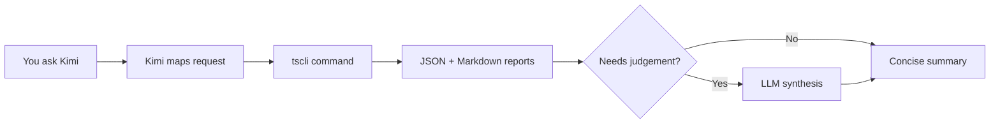

# Kimi Trading Skills documentation

Welcome to the **Kimi Trading Skills** user documentation. This is a code-first trading assistant for [Kimi Code CLI](https://moonshotai.github.io/kimi-code/), ported from [Claude Trading Skills](https://tradermonty.github.io/claude-trading-skills/en/getting-started/).

The assistant drives a Python CLI called `tscli`. You describe what you want in plain English, Kimi maps it to a `tscli` command, and you get structured JSON + Markdown reports for review. No live orders are placed.

## Get started

New users should start here:

- [Getting started](./getting-started.md) — install, configure, and run your first command in under 10 minutes.

## Browse by topic

| Guide | What you'll learn |
|-------|-------------------|
| [Commands](./commands.md) | Implemented `tscli` commands and the command roadmap |
| [Brokers](./brokers.md) | Connect Futubull OpenD, IB Gateway, or use manual mode |
| [Reports](./reports.md) | JSON + Markdown report envelope and file naming |
| [Workflows](./workflows.md) | How multi-step trading routines work |
| [Safety](./safety.md) | No-live-orders policy and decision gates |
| [Troubleshooting](./troubleshooting.md) | Common errors and how to fix them |

## Architecture at a glance

## Project resources

- **CLI source:** `src/tscli/`
- **Skill file:** `skills/kimi-trading-skills/SKILL.md`
- **Design spec:** `docs/superpowers/specs/2026-07-09-kimi-trading-skills-design.md`
- **This redesign spec:** `docs/superpowers/specs/2026-07-09-kimi-trading-skills-user-docs-design.md`
