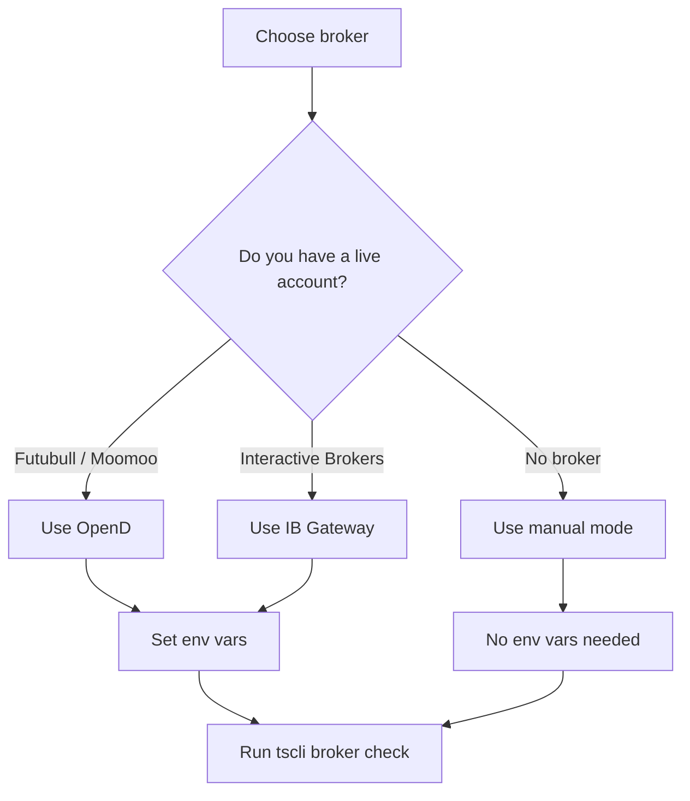

# Brokers

Kimi Trading Skills supports three data/broker modes:

- **Futubull via OpenD** (Moomoo-compatible)
- **Interactive Brokers via IB Gateway**
- **Manual mode** — no credentials required; uses `yfinance` and fixture data

## Choose your broker



## Futubull OpenD

1. Open the Futubull desktop app and log in.
2. Start OpenD if it is not already running.
3. Set the environment variables before starting Kimi:

```bash
export TSCLI_BROKER=opend
export TSCLI_OPEND_HOST=127.0.0.1
export TSCLI_OPEND_PORT=11111
```

4. In Kimi, ask:

```text
Check my broker connection.
```

Kimi runs:

```bash
uv run tscli broker check --broker opend --output-dir reports/
```

## Interactive Brokers via IB Gateway

1. Start IB Gateway and log in.
2. Enable API connections.
3. Set the environment variables:

```bash
export TSCLI_BROKER=ibkr
export TSCLI_IBKR_HOST=127.0.0.1
export TSCLI_IBKR_PORT=7496
export TSCLI_IBKR_CLIENT_ID=1
```

4. In Kimi, ask:

```text
Check my broker connection.
```

Kimi runs:

```bash
uv run tscli broker check --broker ibkr --output-dir reports/
```

## Manual mode

If you do not have a broker connected, use `manual` mode. You can still run market analysis; broker-specific commands return fixture or placeholder output.

```bash
uv run tscli broker check --broker manual --output-dir reports/
uv run tscli broker positions --broker manual --output-dir reports/
```

> **Note:** Manual mode is the default when no broker credentials are set.

## Environment variable reference

| Variable | Required for | Example |
|----------|--------------|---------|
| `TSCLI_BROKER` | All broker commands | `opend`, `ibkr`, `manual` |
| `TSCLI_OPEND_HOST` | Futubull OpenD | `127.0.0.1` |
| `TSCLI_OPEND_PORT` | Futubull OpenD | `11111` |
| `TSCLI_IBKR_HOST` | IB Gateway | `127.0.0.1` |
| `TSCLI_IBKR_PORT` | IB Gateway | `7496` |
| `TSCLI_IBKR_CLIENT_ID` | IB Gateway | `1` |
| `TSCLI_OUTPUT_DIR` | All commands | `reports/` |

Add the `export` lines to your shell config (`~/.zshrc` or `~/.bashrc`) so they persist across terminal sessions.
