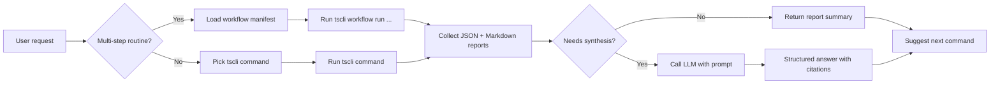

# Commands

You describe what you want in plain English, and Kimi maps your request to a `tscli` command. This page lists the currently implemented commands and the roadmap.

## How a request becomes a command

## Implemented commands

These commands are available now.

### Broker commands

| What you ask Kimi | `tscli` command | Purpose |
|-------------------|-----------------|---------|
| Check broker connection | `tscli broker check --broker {manual,opend,ibkr}` | Verify connectivity and credentials |
| Show my positions | `tscli broker positions --broker {manual,opend,ibkr}` | List holdings from the broker adapter |

### Market commands

| What you ask Kimi | `tscli` command | Purpose |
|-------------------|-----------------|---------|
| Run market regime check | `tscli market regime --output-dir reports/` | Daily posture + exposure guidance |

## Command roadmap

These commands are defined in the skill file and will be added in later releases:

| Capability | `tscli` command | Status |
|------------|-----------------|--------|
| Market breadth | `tscli market breadth` | Planned |
| Momentum screen | `tscli screen momentum` | Planned |
| VCP screen | `tscli screen vcp` | Planned |
| Portfolio analysis | `tscli portfolio analyze` | Planned |
| Position size | `tscli trade size` | Planned |
| Trade plan | `tscli trade plan` | Planned |
| Pre-trade gate | `tscli trade gate` | Planned |
| Journal create | `tscli journal create` | Planned |
| Journal list | `tscli journal list` | Planned |
| Journal close | `tscli journal close` | Planned |
| Workflow run | `tscli workflow run` | Planned |
| LLM analysis | `tscli llm analyze` | Planned |

## Common options

Most commands support these options:

| Option | Description | Example |
|--------|-------------|---------|
| `--output-dir` | Where to write reports | `--output-dir reports/` |
| `--broker` | Broker adapter for broker commands | `--broker manual` |
| `--as-of` | Backdate a market command | `--as-of 2026-07-09` |

## Integration mapping

| Capability | Claude Trading Skills equivalent | Kimi port |
|------------|----------------------------------|-----------|
| Market regime | `market-breadth-analyzer`, `uptrend-analyzer`, `exposure-coach` | `tscli market regime` |
| Momentum scan | `stockbee-momentum-burst-screener` | `tscli screen momentum` |
| VCP scan | `vcp-screener` | `tscli screen vcp` |
| Portfolio review | `portfolio-manager` | `tscli portfolio analyze` |
| Position size | `position-sizer` | `tscli trade size` |
| Trade plan | `breakout-trade-planner` | `tscli trade plan` |
| Pre-trade check | `pre-trade-discipline-gate` | `tscli trade gate` |
| Journal | `trader-memory-core` | `tscli journal` |
| Workflows | `workflows/*.yaml` | `tscli workflow run` |
