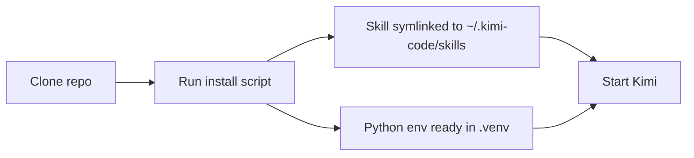
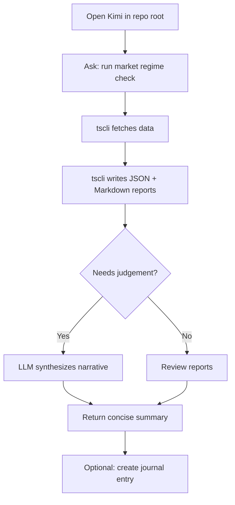

# Getting started with Kimi Trading Skills

This guide walks you through installing Kimi Trading Skills on a Mac and running your first `tscli` command.

## Prerequisites

| Requirement | Why you need it |
|-------------|-----------------|
| macOS with `git` | To clone the repository |
| `uv` package manager | To install Python dependencies. See [https://docs.astral.sh/uv/](https://docs.astral.sh/uv/) |
| Kimi Code CLI | The agent host. See [https://moonshotai.github.io/kimi-code/](https://moonshotai.github.io/kimi-code/) |
| One broker or data setup | Futubull OpenD, IB Gateway, or `manual` mode |
| OpenAI-compatible LLM API key | Optional, only for LLM synthesis features |

> **Tip:** You do **not** need a Finviz or Financial Modeling Prep subscription. `tscli` uses `yfinance`, broker data, public CSVs, and web search.

## Installation



Run these commands in a terminal:

```bash
# 1. Clone the repository
git clone https://github.com/samdharma/trading_skills.git
cd trading_skills

# 2. Install the skill and Python dependencies
bash scripts/install-kimi-skill.sh
```

The install script does two things:

1. Creates `~/.kimi-code/skills/kimi-trading-skills` as a symlink to `skills/kimi-trading-skills/`.
2. Installs `tscli` and its dependencies into a local `.venv/` using `uv`.

> **Important:** Keep the `trading_skills` folder. The skill symlink and `uv run tscli` commands depend on files inside it.

## Start Kimi with the skill loaded

From the repo root:

```bash
kimi --skills-dir ./skills
```

From anywhere:

```bash
kimi --skills-dir ~/.kimi-code/skills
```

Verify the skill loaded by asking:

```text
Which skills are loaded?
```

You should see `kimi-trading-skills` listed under the **User** scope.

## Run your first command

The fastest way to confirm everything works is the broker check in `manual` mode. It needs no broker credentials.

Ask Kimi:

```text
Run a broker check in manual mode.
```

Kimi executes:

```bash
uv run tscli broker check --broker manual --output-dir reports/
```

You should see two files appear in `reports/`:

```text
broker_check_YYYYMMDD_HHMMSS.json
broker_check_YYYYMMDD_HHMMSS.md
```

Open the Markdown report to review the result.

## Run a daily market-regime check

Ask Kimi:

```text
Run a daily market regime check.
```

Kimi executes:

```bash
uv run tscli market regime --output-dir reports/
```

The report contains a market posture (`risk_on`, `risk_off`, `neutral`, or `selective`) and exposure guidance.

## Daily workflow example



A typical morning routine:

1. `tscli market regime` — get exposure guidance.
2. Ask Kimi to screen for momentum or VCP candidates when those commands are available.
3. Ask Kimi to interpret results against your open positions.
4. If a candidate looks actionable, ask Kimi to create a thesis entry in the journal.

## Next steps

- [Connect a broker](./brokers.md)
- [Explore all commands](./commands.md)
- [Understand reports](./reports.md)
- [Review safety rules](./safety.md)
