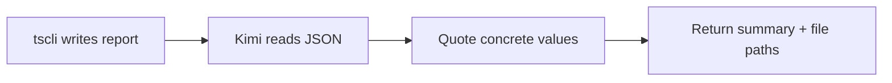

# Reports

Every `tscli` command writes two files to the output directory:

- `*.json` — structured data for downstream use
- `*.md` — human-readable mirror of the JSON

## File naming

```text
<skill>_<type>_<YYYYMMDD_HHMMSS>.json
<skill>_<type>_<YYYYMMDD_HHMMSS>.md
```

For example:

```text
market_regime_20260709_143052.json
market_regime_20260709_143052.md
broker_check_20260709_143110.json
broker_check_20260709_143110.md
```

## JSON envelope

Every report shares the same top-level envelope:

```json
{
  "schema_version": "1.0",
  "skill": "<command-name>",
  "metadata": {
    "run_at": "ISO-8601 timestamp",
    "data_sources": ["yfinance", "opend", "ibkr", "public_csv", "llm"],
    "broker_adapter": "opend|ibkr|manual",
    "llm_model": "gpt-4o-mini"
  },
  "data": { }
}
```

The `data` object contains the command-specific payload.

## How Kimi uses reports



When Kimi returns results, it quotes specific fields from the JSON rather than just naming the file. This makes answers concrete and traceable.

## Report directory

The default output directory is `reports/` in the repo root. Change it with:

```bash
export TSCLI_OUTPUT_DIR=/path/to/reports
```

Or pass `--output-dir` on each command:

```bash
uv run tscli market regime --output-dir /tmp/reports/
```

## Validation

Reports are validated against `skills/kimi-trading-skills/assets/schemas/report.schema.json` before being consumed downstream. If a downstream command fails with a schema error, re-run the upstream command and check the report contents.
