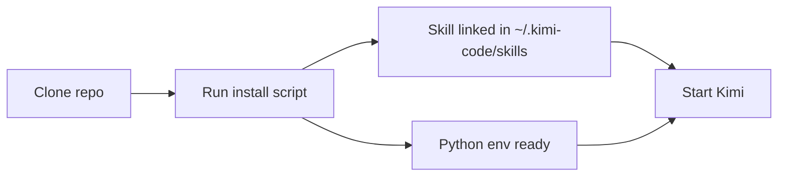
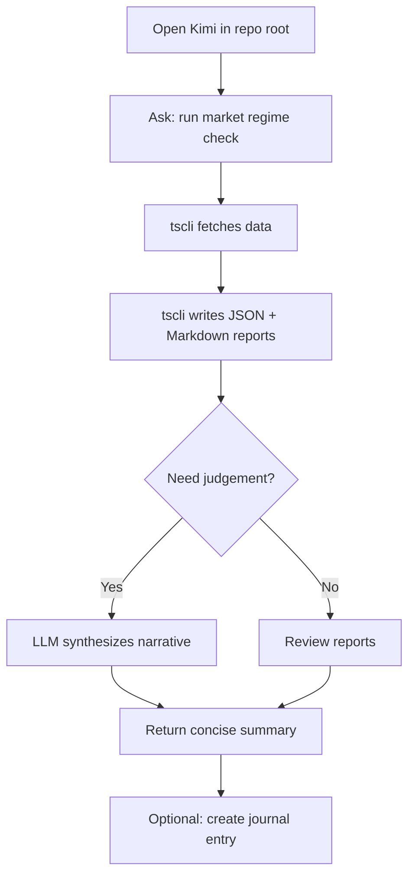

# Kimi Trading Skills — User Guide

This guide explains how to install, configure, and use the **Kimi Trading Skills** assistant on a new Mac.

The assistant is a Kimi Code CLI skill that drives a Python CLI called `tscli`. It helps with market-regime checks, screening, portfolio analysis, trade planning, and journaling.

---

## What you get

- A code-first workflow: you tell Kimi what you want in plain English, and it runs `tscli` commands.
- Every command produces **JSON + Markdown** reports under `reports/`.
- No live order execution. The skill emits analysis, checklists, and order templates for human review.
- Works with **Futubull OpenD** or **Interactive Brokers via IB Gateway**.
- No Finviz or FMP subscription is required.

---

## Prerequisites

Before you start, make sure you have:

| Requirement | Why you need it |
|-------------|-----------------|
| macOS with `git` | To clone the repo |
| `uv` package manager | To install Python dependencies. See [https://docs.astral.sh/uv/](https://docs.astral.sh/uv/) |
| Kimi Code CLI | The agent host. See [https://moonshotai.github.io/kimi-code/](https://moonshotai.github.io/kimi-code/) |
| One broker/data setup | Either Futubull OpenD, IB Gateway, or `manual` mode |
| OpenAI-compatible LLM API key | Optional, needed only for LLM synthesis features |

---

## Install



Run these commands in a terminal:

```bash
# 1. Clone the repo
git clone https://github.com/samdharma/trading_skills.git
cd trading_skills

# 2. Install the skill and Python dependencies
bash scripts/install-kimi-skill.sh
```

The script:

- creates `~/.kimi-code/skills/kimi-trading-skills` as a symlink to `skills/kimi-trading-skills/`
- installs `tscli` and its dependencies into a local `.venv/`

> **Important:** keep the `trading_skills` folder. The skill symlink and `uv run tscli` commands depend on files inside it.

---

## Start a Kimi session

From the repo root:

```bash
kimi --skills-dir ./skills
```

Or from anywhere:

```bash
kimi --skills-dir ~/.kimi-code/skills
```

You can verify the skill loaded by asking:

> "Which skills are loaded?"

You should see `kimi-trading-skills` listed under the **User** scope.

---

## First commands to try

These examples use `manual` broker mode, so they work without a live broker connection.

### Check that the CLI is healthy

```text
Run a broker check in manual mode.
```

Kimi will execute:

```bash
uv run tscli broker check --broker manual --output-dir reports/
```

You should get a JSON report and a Markdown report in `reports/`.

### Run a daily market-regime check

```text
Run a daily market regime check.
```

Kimi will execute:

```bash
uv run tscli market regime --output-dir reports/
```

The output is a posture (`risk_on`, `risk_off`, `neutral`, `selective`) plus exposure guidance.

---

## Daily workflow example



A typical morning routine:

1. `tscli market regime` — get exposure guidance.
2. `tscli screen momentum` — build a watchlist.
3. Ask Kimi to interpret the results and compare them to your open positions.
4. If a candidate looks actionable, ask Kimi to create a thesis entry in the journal.

---

## Connect a broker

### Futubull OpenD

1. Open the Futubull desktop app and log in.
2. Start OpenD if it is not already running.
3. Set the environment variables before starting Kimi:

```bash
export TSCLI_BROKER=opend
export TSCLI_OPEND_HOST=127.0.0.1
export TSCLI_OPEND_PORT=11111
```

4. In Kimi, ask:

```text
Check my broker connection.
```

### Interactive Brokers via IB Gateway

1. Start IB Gateway and log in.
2. Enable API connections.
3. Set the environment variables:

```bash
export TSCLI_BROKER=ibkr
export TSCLI_IBKR_HOST=127.0.0.1
export TSCLI_IBKR_PORT=7496
export TSCLI_IBKR_CLIENT_ID=1
```

4. In Kimi, ask:

```text
Check my broker connection.
```

### Manual mode

If you do not have a broker connected, use `manual` mode. You can still run market analysis and screens with `yfinance` and public data.

---

## LLM setup

The skill can call an OpenAI-compatible LLM for regime synthesis, theme detection, and pre-trade discipline.

Set these environment variables:

```bash
export TSCLI_LLM_API_KEY=sk-...
export TSCLI_LLM_BASE_URL=https://api.openai.com/v1
export TSCLI_LLM_MODEL=gpt-4o-mini
```

If you do not set these, the CLI falls back to deterministic reports without LLM synthesis.

---

## Available commands

| What you ask Kimi | `tscli` command it runs |
|-------------------|-------------------------|
| Check broker connection | `tscli broker check` |
| Show my positions | `tscli broker positions` |
| Run market regime check | `tscli market regime` |
| Analyze market breadth | `tscli market breadth` |
| Screen for momentum burst | `tscli screen momentum` |
| Screen for VCP-like patterns | `tscli screen vcp` |
| Analyze my portfolio | `tscli portfolio analyze` |
| Calculate position size | `tscli trade size` |
| Generate an order template | `tscli trade plan` |
| Run pre-trade discipline gate | `tscli trade gate` |
| Create a trade thesis | `tscli journal create` |
| List open theses | `tscli journal list` |
| Close a thesis | `tscli journal close` |
| Run a workflow manifest | `tscli workflow run` |

You do not need to remember the commands. Describe what you want in natural language and Kimi will map it.

---

## Reports

Every command writes two files to `reports/`:

- `*.json` — structured data for downstream use.
- `*.md` — human-readable mirror of the JSON.

File names use the pattern:

```text
<skill>_<YYYYMMDD_HHMMSS>.json
<skill>_<YYYYMMDD_HHMMSS>.md
```

Kimi will quote the key fields from the JSON report when it answers you.

---

## Safety rules

- The skill **never** places live orders.
- Order templates are emitted with `requires_manual_confirmation: true`.
- Workflows with decision gates pause for your approval.
- Default broker mode is `manual` if no credentials are set.

---

## Updating

To update the skill after the repo changes:

```bash
cd trading_skills
git pull origin main
bash scripts/install-kimi-skill.sh
```

The install script re-creates the symlink and refreshes the Python environment.

---

## Troubleshooting

| Problem | Likely cause | Fix |
|---------|--------------|-----|
| `uv: command not found` | `uv` not installed | Install from [https://docs.astral.sh/uv/](https://docs.astral.sh/uv/) |
| `No module named tscli` | Dependencies not installed | Run `bash scripts/install-kimi-skill.sh` |
| `kimi-trading-skills` not loaded | Wrong `--skills-dir` path | Use `kimi --skills-dir ~/.kimi-code/skills` or `kimi --skills-dir ./skills` from the repo root |
| Broker check fails | OpenD / IB Gateway not running | Start the gateway and check env vars |
| Reports are empty | `manual` mode with no fixtures | Set broker env vars or accept placeholder output in Phase 1 |
| LLM synthesis is skipped | Missing `TSCLI_LLM_API_KEY` | Set the API key and restart Kimi |

---

## Next steps

- Read the design spec: `docs/superpowers/specs/2026-07-09-kimi-trading-skills-design.md`
- Read the skill file: `skills/kimi-trading-skills/SKILL.md`
- Run `bash scripts/run_all_tests.sh` to verify the CLI is healthy.
