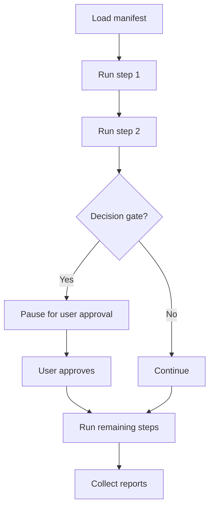

# Workflows

Workflows let you run multi-step trading routines from a YAML manifest. They are the skill's way of handling repeatable processes like a morning routine or a pre-trade checklist.

> **Status:** The workflow engine is planned but not yet implemented. This page describes how it will work once available.

## Workflow lifecycle



## Manifest structure

Workflow manifests live in `skills/kimi-trading-skills/assets/workflows/`. A manifest declares a sequence of `tscli` commands and optional decision gates.

```yaml
name: morning-routine
steps:
  - command: market regime
  - command: broker positions
  - command: screen momentum
    args: "--universe sp500"
  - command: trade gate
    decision_gate: true
    prompt: "Proceed with the top candidate?"
```

## Decision gates

When a step has `decision_gate: true`, the skill stops and presents the question to you. It does **not** auto-approve. This is part of the no-live-orders safety model.

## Planned commands

Once implemented, you will be able to run:

```bash
# List available workflows
uv run tscli workflow list

# Preview a workflow without executing it
uv run tscli workflow run --manifest workflows/market-regime-daily.yaml --dry-run

# Run a workflow
uv run tscli workflow run --manifest workflows/market-regime-daily.yaml
```

## Example use cases

- **Morning routine:** regime → breadth → positions → momentum screen
- **Pre-trade checklist:** thesis → position size → trade gate → journal create
- **Weekly review:** positions → portfolio analyze → journal list → close theses
