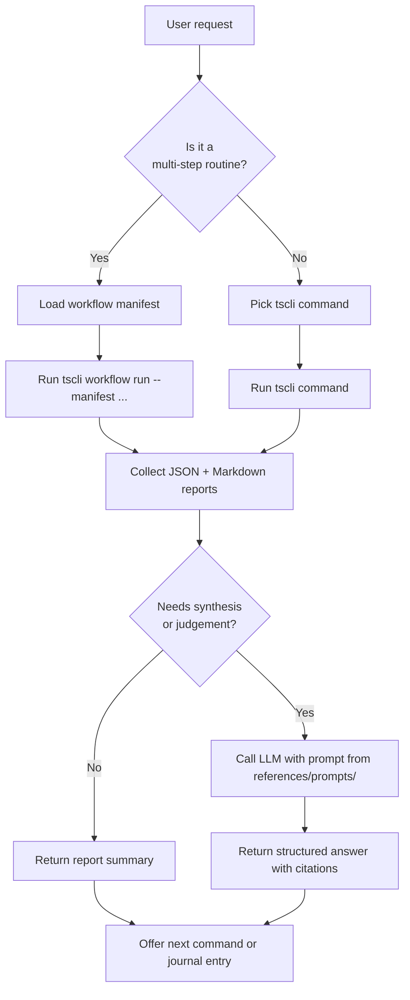

# Kimi Trading Skills

Systematic, code-first trading assistant for solo traders. The skill directs the agent to run the `tscli` command-line tool, read its JSON/Markdown reports, and use an LLM for judgement-heavy analysis.

This skill is intentionally broker-agnostic at the core, but the first release targets:

- **Futubull via OpenD** (Moomoo-compatible)
- **Interactive Brokers via IB Gateway**

No live orders are sent. The skill emits order templates, checklists, and journal entries for human confirmation.

---

## When to Use

Use this skill when the user asks for anything related to:

- Daily/weekly market regime, breadth, trend, or exposure guidance.
- Stock screens (momentum burst, VCP-like, trend-template) using free/broker data.
- Portfolio analysis, rebalancing, concentration, or risk review.
- Position sizing, trade planning, or pre-trade discipline checks.
- Recording, reviewing, or closing trade theses in a journal.
- Running a multi-step trading workflow from a YAML manifest.
- Fetching data or positions from Futubull OpenD or IB Gateway.

---

## Prerequisites

Before using this skill, confirm the environment has:

1. **Python 3.9+** and `uv` installed.
2. The `tscli` package installed from this repo:
   ```bash
   uv sync
   uv run tscli --help
   ```
3. One of the supported broker/data configurations:
   - **Futubull OpenD**: running locally and authenticated.
   - **IB Gateway**: running locally with a NASDAQ data subscription.
   - **Manual mode**: no credentials required; uses fixtures and `yfinance`.
4. Environment variables set as needed:
   - `TSCLI_BROKER` — `opend`, `ibkr`, or `manual`.
   - `TSCLI_OPEND_HOST` / `TSCLI_OPEND_PORT` (default `127.0.0.1:11111`).
   - `TSCLI_IBKR_HOST` / `TSCLI_IBKR_PORT` / `TSCLI_IBKR_CLIENT_ID`.
   - `TSCLI_LLM_API_KEY` / `TSCLI_LLM_BASE_URL` / `TSCLI_LLM_MODEL`.
   - `TSCLI_OUTPUT_DIR` (default `reports/`).

---

## Workflow



### Step-by-step discipline

1. **Parse the user request** and map it to a `tscli` command or a workflow manifest.
2. **Check prerequisites** (broker/data/LLM). If something is missing, ask the user or fall back to `manual` mode.
3. **Run the CLI command**. Prefer `--dry-run` first when the user is uncertain.
4. **Read the generated JSON report** under `reports/`. Quote specific fields, not just the file name.
5. **Use the LLM** when the request requires synthesis, scenario analysis, theme detection, or a disciplined pre-trade review.
6. **Write or update a journal entry** when the result is a tradeable idea or a closed position.
7. **Return a concise summary** in Markdown with:
   - What was run.
   - Key findings with data provenance.
   - Confidence level.
   - Suggested next action.

---

## Commands

### Market regime

```bash
# Daily regime snapshot (breadth + trend + exposure guidance)
uv run tscli market regime --output-dir reports/

# Breadth only
uv run tscli market breadth --output-dir reports/
```

### Screening

```bash
# Momentum-burst scan on the S&P 500 universe
uv run tscli screen momentum --universe sp500 --output-dir reports/

# VCP-like pattern scan
uv run tscli screen vcp --universe sp500 --output-dir reports/
```

### Portfolio

```bash
# Fetch holdings and emit allocation/risk/rebalance report
uv run tscli portfolio analyze --broker opend --output-dir reports/

# Manual mode with a fixture file
uv run tscli portfolio analyze --broker manual --positions-file fixtures/positions.json --output-dir reports/
```

### Trade planning and sizing

```bash
# Position size
uv run tscli trade size --account-size 100000 --entry 230 --stop 218 --risk-pct 1.0 --output-dir reports/

# Generate an order template from a thesis
uv run tscli trade plan --thesis-file reports/thesis_aapl_20260709.json --output-dir reports/

# Pre-trade discipline gate
uv run tscli trade gate --thesis-file reports/thesis_aapl_20260709.json --output-dir reports/
```

### Journal

```bash
uv run tscli journal create --from-report reports/vcp_screener_20260709.json --output-dir reports/
uv run tscli journal list --status ENTRY_READY
uv run tscli journal close --thesis-id <id> --exit-price 245.0 --exit-reason "target_hit"
```

### Workflows

```bash
uv run tscli workflow list
uv run tscli workflow run --manifest workflows/market-regime-daily.yaml --dry-run
uv run tscli workflow run --manifest workflows/market-regime-daily.yaml
```

### LLM analysis

```bash
# Ask an LLM to interpret any report
uv run tscli llm analyze --prompt references/prompts/regime-synthesis.md --input-file reports/market_regime_20260709.json
```

---

## Output Format

Every CLI command writes:

- A **JSON report** with envelope:
  ```json
  {
    "schema_version": "1.0",
    "skill": "<command-name>",
    "metadata": {
      "run_at": "ISO-8601",
      "data_sources": ["..."],
      "broker_adapter": "opend|ibkr|manual",
      "llm_model": "..."
    },
    "data": { }
  }
  ```
- A **Markdown report** that mirrors the JSON for human review.
- Files follow the pattern: `<skill>_<type>_<YYYYMMDD_HHMMSS>.{json,md}`.

When returning results to the user, quote concrete values from the JSON and include the report file paths.

---

## Key Principles

1. **CLI-first.** Do not write ad-hoc scripts when a `tscli` command exists. If a command does not exist, propose extending `tscli` rather than inventing a one-off script.
2. **Structured reports.** Always consume the JSON output; use the Markdown file only for display summaries.
3. **Data provenance.** Cite the source of every number (e.g., `yfinance`, `opend`, `ibkr`, `public_csv`, `llm`).
4. **No live orders.** The skill only emits order templates. Never call a broker API to place, modify, or cancel an order.
5. **Decision gates.** When a workflow declares `decision_gate: true`, stop and present the question to the user. Do not auto-approve.
6. **LLM for judgement.** Use the LLM for synthesis, theme detection, scenario analysis, and pre-trade sanity checks. Do not use the LLM for raw price calculations.
7. **Journal everything.** Tradeable ideas and closed trades should be recorded in the thesis journal.

---

## Resources

- **Spec:** `docs/superpowers/specs/2026-07-09-kimi-trading-skills-design.md`
- **Broker matrix:** `skills/kimi-trading-skills/references/broker-matrix.md`
- **Data-source alternatives:** `skills/kimi-trading-skills/references/data-source-alternatives.md`
- **Prompts:** `skills/kimi-trading-skills/references/prompts/`
- **Workflow manifests:** `skills/kimi-trading-skills/assets/workflows/`
- **JSON schemas:** `skills/kimi-trading-skills/assets/schemas/`

---

## Integration Mapping

| Capability | Claude Trading Skills equivalent | Kimi port |
|------------|----------------------------------|-----------|
| Market regime | `market-breadth-analyzer`, `uptrend-analyzer`, `market-top-detector`, `exposure-coach` | `tscli market regime` |
| Momentum scan | `stockbee-momentum-burst-screener` | `tscli screen momentum` |
| VCP scan | `vcp-screener` | `tscli screen vcp` (yfinance rewrite) |
| Portfolio review | `portfolio-manager` | `tscli portfolio analyze` |
| Position size | `position-sizer` | `tscli trade size` |
| Trade plan | `breakout-trade-planner`, `parabolic-short-trade-planner` | `tscli trade plan` |
| Pre-trade check | `pre-trade-discipline-gate` | `tscli trade gate` |
| Journal | `trader-memory-core` | `tscli journal` |
| Workflows | `workflows/*.yaml` | `tscli workflow run` |

**Dropped or replaced:**
- `finviz-screener` — dropped (no Finviz).
- `canslim-screener`, `pead-screener`, `ftd-detector`, `ibd-distribution-day-monitor` — rewritten with `yfinance`/broker data where feasible, otherwise dropped from MVP.

---

## Safety Rules

- Default to `--broker manual` if credentials are missing.
- Always print `requires_manual_confirmation: true` for order templates.
- Never execute a workflow step with `decision_gate: true` without user confirmation.
- Store API keys in environment variables; do not hard-code or log them.
- Validate every report against `assets/schemas/report.schema.json` before consuming it downstream.
